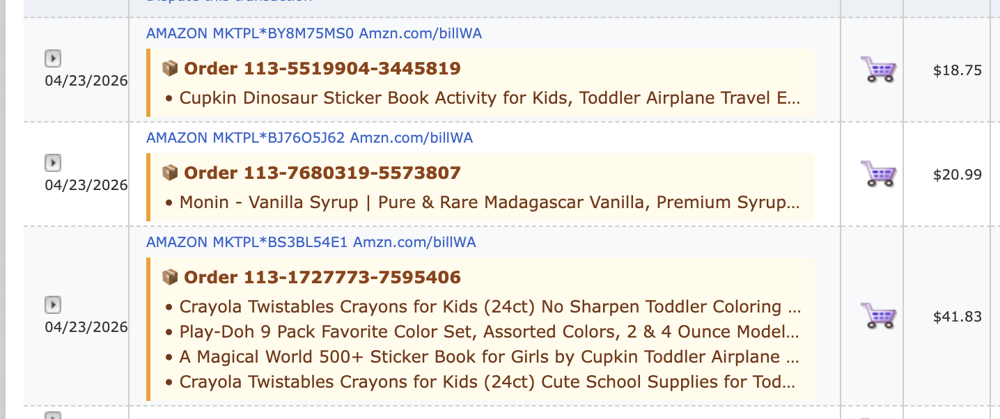

# Purchase Lens

A Chrome extension that annotates Amazon charges on Bank of America bank statements with the actual item names you purchased.

## The Problem

Bank statements show Amazon charges as generic entries like `AMAZON MARKETPLA DES:INTERNET` with no description. Amazon also splits single orders into multiple shipments, making reconciliation impossible from the statement alone.

## How It Works

1. When you open your BofA transactions page, the extension silently opens a background Amazon tab
2. It scrapes your order history using your existing Amazon session (no login required, no OAuth)
3. The tab closes automatically
4. Amazon charges on the BofA page are annotated with the real item names

All data stays local in `chrome.storage.local` — nothing is sent to any server.

## Installation (Developer Mode)

1. Clone this repo
2. Open Chrome → `chrome://extensions`
3. Enable **Developer mode** (top right)
4. Click **Load unpacked** → select the `extension/` folder

## Usage

- Open your BofA account transactions page
- An Amazon tab will briefly appear and close in the background
- Amazon charges will show a label like: `📦 FMS Car Accessory Lipo Battery 2S 7.4V...`
- Hover the label to see the full item name and order number

## Popup

Click the extension icon to see how many orders are cached and when the last sync was. Use **Clear Cache & Re-sync** to force a fresh fetch from Amazon.

## Debug Page

The popup has an "Open scrape debugger" link that shows exactly what order data was extracted from Amazon, useful for diagnosing matching issues.

## Limitations

- Matches by per-shipment charge amount + date (±8 days). Fetches invoice pages to extract individual shipment totals for split orders.
- Only works for the bank/card account the Amazon order was charged to.
- Requires being logged into Amazon in the same Chrome profile.
- BofA's DOM selectors may need updating if BofA redesigns their transaction page.
